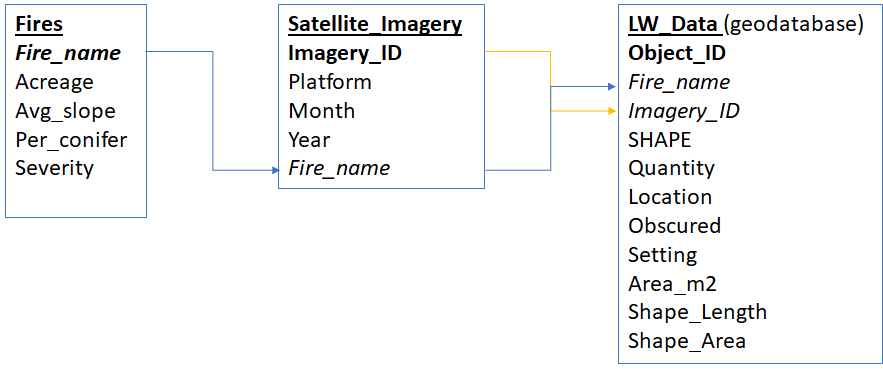

# Data {#data}

```{r setup, include=FALSE}
knitr::opts_chunk$set(echo = TRUE)
```

## Datasets

Fires dataset: These are past wildfires that will serve as study sites. These 18 sites have been selected on the basis of having variable slope steepness, coniferous cover and burn severity.

Satellite Imagery: This consists of Google and Hexagon available aerial imagery that will be used for analysis.Imagery was taken at different points along a 10 year period and varies in resolution and extent.

LW (large wood) dataset: LW features (jams and individual logs) will be stored in this dataset.Attributes of features will be recorded based on the aerial imagery and context of the burn severity as well as the valley bottom.

## Database Structure

LW (large wood) data will be collected for each fire based on available satellite imagery in different years. Each temporal point will consist of an LW dataset and these datasets will be compiled for each fire to comprise a database.




# Build the Database
```{r library, eval=TRUE, echo=FALSE, warning=FALSE}
library(DBI)
library(dplyr)
library(magrittr)
library(tidyverse)
```
First I will connect to the database:

```{r database, eval=TRUE, echo=TRUE}
lw <- dbConnect(RSQLite::SQLite(), "C:/Users/BelmontLab/Documents/Alec/School/Spring 2021/Full Lifecycle of Data Management/R markdown assignment/lw.db")
```

Then I will add each dataset to the database and link them

1. Fires
```{r fires, eval = TRUE, echo = TRUE}
dbExecute(lw, "CREATE TABLE Fires (
Fire_ID INTEGER PRIMARY KEY AUTOINCREMENT,
Fire_Name varchar(25),
Acreage varchar(5),
Avg_slope varchar(5),
Per_conifer varchar(5),
Severity varchar(5),
Burn varchar(25),
Slope varchar(25),
Trees varchar(25),
Class varchar(25),
DebrisFlowFire varchar(3)
);")
```

```{r fires2, eval = TRUE, echo = TRUE}
fires <- read.csv("C:/Users/BelmontLab/Documents/Alec/School/Spring 2021/Full Lifecycle of Data Management/Bookdown/Bookdown- LW/Fires.csv")

fires$Fire_ID <- 1:nrow(fires)

dbWriteTable(lw, "Fires", fires, append = TRUE)
```

```{r fires3, eval = TRUE, echo = TRUE}
fires<-dbGetQuery(lw, "SELECT * FROM Fires;")
```


2. Imagery
```{r imagery, eval = TRUE, echo = TRUE}
dbExecute(lw, "CREATE TABLE Aerial_Imagery (
Imagery_ID INTEGER PRIMARY KEY AUTOINCREMENT,
Fire_Name varchar(25),
Type varchar(50),
Fire_Year char(4),
years varchar(10),
Source varchar(25),
year char(4),
FOREIGN KEY (Fire_Name) REFERENCES Fires(Fire_Name)
);")
```

```{r imagery2, eval = TRUE, echo = TRUE}
imagery <- read.csv("C:/Users/BelmontLab/Documents/Alec/School/Spring 2021/Full Lifecycle of Data Management/Bookdown/Bookdown- LW/aerial.csv") 

names(imagery)[1] <- "Fire_Name"

imagery<-imagery %>% 
     pivot_longer(`Before`:`Year.8`, values_to = "Source", names_to = "years") %>% mutate(year = stringr::word(Source, 2, 2, " "), Source = stringr::word(Source, 1, 1, " ")) 

imagery$Imagery_ID <- 1:nrow(imagery)

dbWriteTable(lw, "Aerial_Imagery", imagery, append = TRUE)
```

```{r imagery3, eval = TRUE, echo = TRUE}
aerial<-dbGetQuery(lw, "SELECT * FROM Aerial_Imagery;")
```

3. Large Wood
```{r large wood, eval = TRUE, echo = TRUE}

dbExecute(lw, "CREATE TABLE LW_DATA (
OBJECTID varchar(3) NOT NULL,
Fire_Name varchar(25),
Imagery_ID varchar(2),
Quantity varchar(3),
Location varchar(20) CHECK (Location IN ('Channel', 'Overhanging', 'Floodplain', 'Channel_Spanning')),
Obscured varchar(20) CHECK (Obscured IN ('No', 'Some','Many','Unclear')),
Setting varchar(20) CHECK (Setting IN ('Upstream', 'Debris Flow','Bank','NA')),
Burned varchar(20),
Area_m2 varchar(5),
SHAPE_Length varchar(5),
SHAPE_Area varchar(5),
PRIMARY KEY (OBJECTID),
FOREIGN KEY (Fire_Name) REFERENCES Fires(Fire_Name)
FOREIGN KEY (Imagery_ID) REFERENCES Aerial_Imagery(Imagery_ID)
);")
```

```{r large wood2, eval = TRUE, echo = TRUE}
lw_table <- read.csv("C:/Users/BelmontLab/Documents/Alec/School/Spring 2021/Full Lifecycle of Data Management/Bookdown/Bookdown- LW/lw.csv") 

dbWriteTable(lw, "LW_DATA", lw_table, append = TRUE)
```

```{r large wood3, eval = TRUE, echo = TRUE}
lw_data<-dbGetQuery(lw, "SELECT * FROM LW_DATA;")
```


> "That's all folks!"